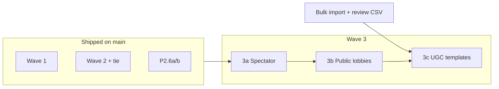

# MemeFight Party — Wave 3 split (3a / 3b / 3c)

**Date:** 2026-06-04  
**Status:** Planning — not started  
**Depends on:** Bulk template staging + review infra (Wave 3c UGC)

## Overview

Wave 3 is split into three shippable tracks to limit risk and reuse prior work.

## 3a — Spectator / late-join watch mode

**Goal:** Allow read-only viewers on in-progress rooms (invite link, no score impact).

| Area | Scope |
|------|--------|
| Auth | Optional login; spectator row or `party_spectators` |
| RPC | Read-only snapshot; block submit/vote/guess |
| UI | `PartySpectatorShell` — voting/reveal without inputs |
| Realtime | Same channel; filtered actions |

**Estimate:** 1–2 weeks  
**PR branch:** `feat/party-wave3a-spectator`

## 3b — Public lobbies / matchmaking

**Goal:** Browse open rooms or quick-match into public caption games.

| Area | Scope |
|------|--------|
| DB | `is_public` on `party_rooms`, listing RPC |
| Discovery | `/party/browse` or home CTA |
| Matchmaking | Join random open room with capacity |
| Moderation | Profanity + report hooks (existing) |

**Estimate:** 2–3 weeks  
**PR branch:** `feat/party-wave3b-public-lobbies`  
**Depends on:** 3a patterns for non-host clients (optional)

## 3c — User-generated templates

**Goal:** Players upload meme images; host-approved or auto-quarantine; reuse bulk review pipeline.

| Area | Scope |
|------|--------|
| Storage | Per-user prefix in `party-templates` or separate bucket |
| DB | `party_templates.uploader_id`, `review_status` |
| Import | Extend `bulk-review.csv` pattern for UGC queue |
| Legal | Terms + DMCA path; default `active: false` |

**Estimate:** 3–4 weeks  
**PR branch:** `feat/party-wave3c-ugc`  
**Depends on:** `scripts/bulk-import-party-templates.mjs` + `docs/party-templates-license.md`

## Explicitly deferred (Wave 4+)

- Crew memory / friendlist
- Courtroom theme pack
- Premium bundle

## Recommended ship order

1. **3a** — lowest schema risk, unblocks share/watch links  
2. **3b** — retention at scale  
3. **3c** — highest legal/ops surface; needs review infra from bulk workstream

## Success metrics (per track)

| Track | Metric |
|-------|--------|
| 3a | % rooms with ≥1 spectator; watch link shares |
| 3b | Public room fills/hour; time-to-first-game |
| 3c | UGC templates approved/week; report rate |

## Docs to create before coding each track

- `docs/superpowers/specs/party-wave3a-spectator-design.md`
- `docs/superpowers/specs/party-wave3b-public-lobbies-design.md`
- `docs/superpowers/specs/party-wave3c-ugc-templates-design.md`
