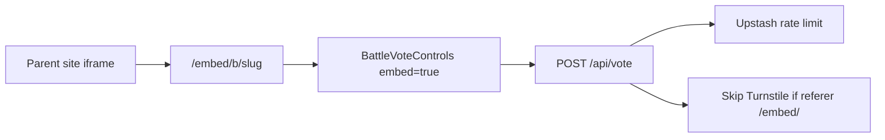

# MemeFight Embed + Trending — Design Spec

**Date:** 2026-06-01  
**Status:** Complete  
**Phase:** Growth (A) + Product (B)

## Goal

Enable viral distribution via embeddable battle widgets and surface top battles on a dedicated trending page — without comments, Pro tier, or 24h trending logic.

## Success Criteria

- `/embed/b/[slug]` loads in third-party iframes; votes work without Turnstile
- CSP `frame-ancestors *` on embed routes; no `X-Frame-Options` on embed routes
- Copy-embed-code on battle page and post-create banner
- `/trending` lists top 24 battles by total votes
- Embed routes `noindex`; `/embed/` disallowed in robots.txt

## Embed Architecture

### Route groups

- `app/(site)/` — header, footer, all public pages
- `app/(embed)/embed/b/[slug]` — chromeless embed surface

### Turnstile decision

Turnstile is **disabled for embed votes**. Protection: Upstash rate limits (20/min IP, 5/min battle+IP) + IP-hash dedup in Postgres. Turnstile skip validated via referer path `/embed/` on same app origin.

### Security headers

- Global: `X-Frame-Options: DENY`, `frame-ancestors 'none'`
- Embed (`/embed/:path*`): CSP only with `frame-ancestors *`; no `X-Frame-Options`

Implemented in [`lib/security-headers.ts`](../../lib/security-headers.ts).

## Trending

- Route: `app/(site)/trending/page.tsx`
- Data: existing `get_feed_with_results` RPC with `p_sort: 'votes'`
- Linked from home, footer, sitemap

## Non-Goals

- Separate Turnstile widget for embed domains (fallback only)
- Trending by 24h votes
- Hall of Fame, analytics dashboard

## Verification

1. Open `scripts/embed-test.html` with dev server — vote in iframe without captcha
2. `curl -I https://memefight.lol/embed/b/pizza-vs-burger-seed01` — no `X-Frame-Options: DENY`
3. Copy embed code from battle page — paste in test HTML
4. `/trending` shows battles sorted by vote count

## Growth Track A (operational)

See [`docs/google-search-console-playbook.md`](../../google-search-console-playbook.md) for GSC setup, 4-week content cadence, and weekly monitoring template.
