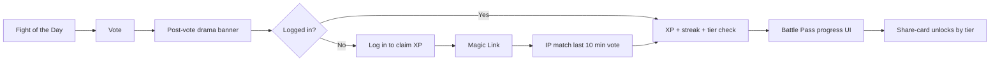

# MemeFight Fight Streak + Battle Pass — Design Spec

**Date:** 2026-06-02  
**Status:** Complete — approved 2026-06-02  
**Phase:** Engagement / retention hook (post-growth)

## Goal

Give MemeFight a daily hook and long-term progression: post-vote drama, Fight of the Day, vote streaks, and a free 5-tier Battle Pass per season — with **login required to earn rewards**, while **anonymous voting remains frictionless** for battle results.

## Success Criteria

- Anonymous users can still vote; logged-in users earn XP, streaks, and badges
- Post-vote banner shows situational drama (underdog / close / winning)
- After anonymous vote: clear CTA *"Log in to claim XP for this vote"*
- After Magic Link login: server credits at most one pending claim per user if an IP-matched vote occurred in the last 10 minutes
- Fight of the Day on home with +25 XP bonus
- Battle Pass shows 5 tiers; daily engaged user (~50 XP/day) reaches Tier 5 in ~30 days
- Badges persist across seasons; XP resets each season

## Non-Goals (v1)

- Paid Battle Pass
- Leaderboards (Phase 2)
- 8–10 Pass tiers (Season 2+, when DAU supports it)
- Push notifications / email for streaks
- Comments or social feed
- Rewards for embed-only votes without login (embed stays result-only)

---

## User Loop



### Product promise

> Every day there's a fight. Pick a side, see if you're in the majority, stack streak & XP, flex with a share card.

---

## Section A — Post-Vote Drama (Hook B)

After vote, show one message based on the user's chosen side vs live results:

| Condition | Copy |
|-----------|------|
| User side **&lt; 40%** | *UNDERDOG — only {pct}% picked your side. Fight back.* |
| **45–55%** (close) | *TOO CLOSE — every vote counts.* |
| User side **majority** | *YOUR SIDE IS WINNING — defend it.* |

Shown in existing post-vote share banner area in [`components/battle-vote-controls.tsx`](../../../components/battle-vote-controls.tsx).

If not logged in, append CTA: **"Log in to claim XP for this vote"** → `/auth/login?returnTo={currentPath}`.

---

## Section B — Fight Streak (Hook C)

### Fight of the Day

- One featured battle per calendar day (UTC) on home hero
- Selection v1: manual `featured_battles` row; fallback = highest `votes_last_24h` from feed RPC
- Logged-in vote on FotD: **+25 XP** (once per day, same as streak day)

### Streak rules

- **Streak** = consecutive UTC days with at least one **rewarded** vote (logged-in claim or direct logged-in vote)
- Display in header when logged in: e.g. `🔥 3-day streak`
- Streak break: neutral copy, no punishment UI

### Streak XP bonus

- Days 2+ of active streak: **+15 XP** on first rewarded vote that day (stacked with base vote XP)

### Badges (persistent across seasons)

| Badge key | Condition |
|-----------|-----------|
| `first_blood` | First rewarded vote ever |
| `week_warrior` | 7-day streak |
| `underdog` | 5× underdog picks (minority side at vote time) |
| `fight_fanatic` | 50 rewarded votes in one season |

---

## Section C — Battle Pass light (5 tiers, Season 1)

### Season

- **4 weeks** per season
- End of season: XP resets to 0, tier progress resets; earned badges/titles remain
- Season 2+: may extend to 8–10 tiers when DAU justifies grind length

### XP sources (logged-in only)

| Action | XP | Notes |
|--------|-----|-------|
| Vote (any battle) | +10 | Once per battle per day for XP (prevent spam re-votes on same battle) |
| Fight of the Day | +25 | First rewarded FotD vote of the day |
| Streak bonus | +15 | First rewarded vote on streak day 2+ |
| Underdog pick | +5 | Optional spice when user side &lt; 40% |

**Daily ceiling (engaged user):** ~10 + 25 + 15 = **50 XP/day** if FotD + streak — Tier 5 (~1500 XP) in ~30 days.

### Tier table (Season 1)

| Tier | XP required | Reward |
|------|-------------|--------|
| 1 | 50 | Title **Rookie** |
| 2 | 200 | Badge |
| 3 | 450 | Share-card style 2 |
| 4 | 800 | Title **Debater** |
| 5 | 1500 | Title **Fight Legend** + special badge |

Cumulative XP thresholds (not per-tier delta).

### Pass UI

- Compact progress bar after vote claim and on `/rewards` (new page) or section under `/my-battles`
- Shows: current tier, XP toward next, season name + days remaining

---

## Section D — Auth & Pending Claim (simplified)

### Rules

1. **Anyone** can vote (existing `voter_token` + IP dedup unchanged)
2. **Rewards** only accrue to `auth.users.id`
3. Logged-in vote: grant XP immediately in same request flow (after successful vote RPC)
4. Anonymous vote: no XP until login

### Pending claim (no localStorage)

After Magic Link login (callback or client redirect):

1. Server loads authenticated user
2. RPC `claim_pending_reward_by_ip`: find latest vote where `ip_hash = hash(current_ip)`, `created_at > now() - 10 minutes`, no `reward_grants` row yet
3. **`user_side_pct` is read from the vote row** — no extra query for battle results at claim time
4. If match: call `grant_reward_for_vote` once (idempotent via `reward_grants` unique on `vote_id`)
5. If no match: show empty state *"Vote on a battle to start earning"*

**Client debounce:** Battle page may call `POST /api/rewards/claim` once per session; set `sessionStorage` flag **only after successful response** — not before fetch (network failure must allow retry).

**Limitations (accepted):** shared IP (office, mobile carrier NAT) may rarely claim wrong vote or miss claim — covers ~95% of real cases without expiring client tokens.

### Vote ↔ user linkage

New table `reward_grants`: `(id, user_id, vote_id, xp_awarded, created_at)` unique on `vote_id` — prevents double-claim on same vote.

**`votes.user_side_pct`** (integer 0–100, nullable for legacy rows): computed and stored at vote insert via extended `cast_vote` RPC. Used for drama, underdog XP, and claim without re-fetching results.

### Atomic grant (critical)

All reward writes run in **one Postgres transaction** via RPC `grant_reward_for_vote`:

1. Insert `reward_grants` (`on conflict (vote_id) do nothing` → early return if already granted)
2. Compute XP, update `reward_grants.xp_awarded`
3. Upsert `user_progress` (streak, season XP)
4. Insert badges (`on conflict do nothing`)

**No sequential client-side Supabase calls** — a crash between writes would cause inconsistent state (e.g. XP credited without grant row → double grant on retry).

---

## Data Model

### New tables

```sql
-- seasons
id uuid PK, name text, starts_at timestamptz, ends_at timestamptz

-- user_progress (one row per user per season)
user_id uuid FK auth.users, season_id uuid FK, xp int default 0,
current_streak int default 0, longest_streak int default 0,
last_rewarded_vote_date date null,
UNIQUE(user_id, season_id)

-- user_badges
user_id uuid, badge_key text, earned_at timestamptz,
UNIQUE(user_id, badge_key)

-- reward_grants
id uuid PK, user_id uuid, vote_id uuid FK votes, xp_awarded int, created_at timestamptz,
UNIQUE(vote_id)

-- featured_battles
battle_id uuid FK, featured_date date UNIQUE
```

### Votes extension

```sql
alter table public.votes
  add column user_side_pct integer check (user_side_pct is null or user_side_pct between 0 and 100);
```

Set at insert by `cast_vote(p_user_side_pct)`; legacy votes remain null (not claimable for underdog XP).

### RPC functions

| Function | Purpose |
|----------|---------|
| `cast_vote(..., p_user_side_pct)` | Store side %; return `vote_id` on success |
| `grant_reward_for_vote(user_id, vote_id, is_featured)` | Atomic grant transaction |
| `claim_pending_reward_by_ip(user_id, ip_hash)` | Find pending vote + grant |

### API routes

| Route | Purpose |
|-------|---------|
| `POST /api/rewards/claim` | After login: IP-based pending claim |
| `GET /api/rewards/me` | XP, tier, streak, badges, season info |
| Internal after logged-in vote | Same grant RPC, called from vote success path |

All reward **writes** go through RPC; TypeScript wrappers are thin. Pure rules (drama copy, tier math) stay in `lib/rewards/*`.

### Runtime

- **Node ≥20** required (`package.json` `engines`; Vercel Node 20.x+)
- Reward unit tests use `node --test` (stable from Node 20)

---

## UI Surfaces

| Surface | Change |
|---------|--------|
| Home | Fight of the Day hero block |
| Battle vote | Drama messages + login CTA |
| Header | Streak + tier pill when logged in |
| `/auth/login` | Preserve `returnTo` for claim flow |
| `/rewards` or My Battles tab | Pass progress, badges, season timer |
| Share | Style 2 card unlocked at Tier 3 |

---

## Implementation Phases

| Phase | Scope | Estimate |
|-------|--------|----------|
| **v1** | Drama copy + login CTA + claim API + XP + 5-tier Pass UI | 2–3 days |
| **v1.1** | Fight of the Day + streak + badges | 1 day |
| **v1.2** | Share-card style 2 at Tier 3 | 1 day |

---

## Verification

1. Vote logged out → drama + login CTA; no XP in `/api/rewards/me`
2. Login within 10 min of vote from same IP → XP granted once; second login does not double-grant
3. Logged-in vote → immediate XP; streak increments on consecutive UTC days
4. FotD vote → +25 once per day
5. Reach 50 XP → Tier 1 title visible
6. Season end → XP resets; badges remain

---

## Open Questions (resolved)

| Question | Decision |
|----------|----------|
| Pending claim mechanism | IP + 10 min window after login; no localStorage |
| Side % at claim time | Stored on `votes.user_side_pct` at vote insert |
| Grant consistency | Single RPC transaction; no multi-call client grants |
| Claim debounce flag | `sessionStorage` set only after successful claim POST |
| Tier count | 5 tiers Season 1; expand in Season 2 |
| Anonymous voting | Allowed; rewards require login |
