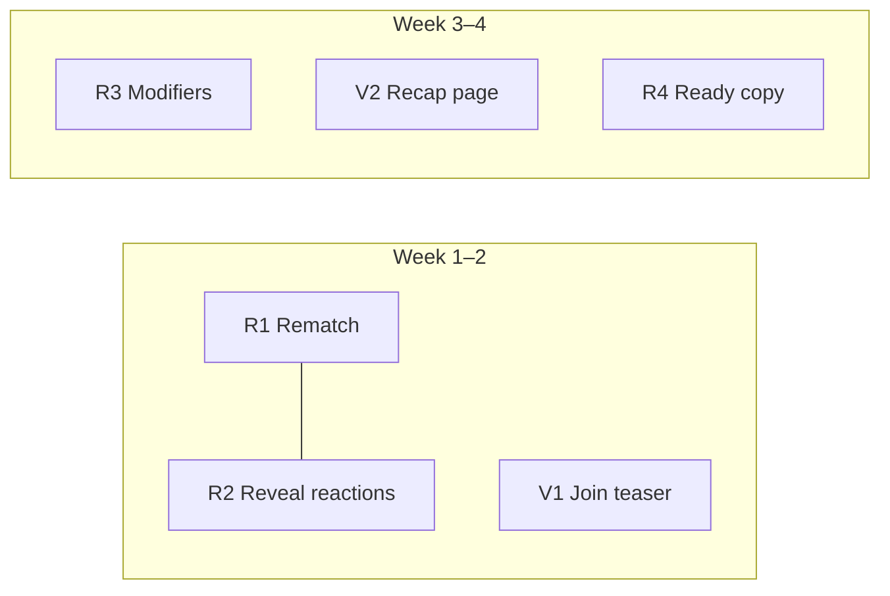

# MemeFight Party — Wave 1 Parallel (Retention + Virality)

**Date:** 2026-06-02 (rev. 2026-06-02 — review clarifications)  
**Status:** Approved — ready for implementation plan  
**Builds on:** P1 Live Party, P1.5 Lobby Reactions, P2 Canvas Editor, Sprint 3 (early advance, ShareCard)  
**Source:** User research (`Ideenversus.txt`) — option **C**: retention and virality in parallel, **mini scope** per feature

## Goal

Increase **sessions per invite** and **out-of-room sharing** without expanding into Arena, Spectator, or async modes. Six independently shippable slices across two tracks:

| Track | Slices |
|-------|--------|
| **R — Retention** | R1 Rematch, R2 Reveal reactions, R3 Round modifiers, R4 Ready pressure copy |
| **V — Virality** | V1 Join teaser, V2 Public recap |

Each slice can land as its own PR. No slice blocks another except shared migration batching (R1 + R2 recommended together).

---

## Success Criteria (4 weeks post-ship)

| Metric | Target |
|--------|--------|
| Rematch rate | ≥30% of `game_finished` rooms trigger `rematch_started` within 5 minutes |
| Invite funnel | `party_peek_viewed` → login → `room_joined` measurable in analytics |
| Recap shares | `recap_link_copied` event on Finished / ShareCard |
| Session depth | Median time-in-room +15–20% vs pre-Wave-1 baseline |

---

## Non-Goals (Wave 1)

| Area | Deferred |
|------|----------|
| Public Arena / live feed | Phase 3 |
| Spectator / late-join queue | Wave 3 |
| Guess the Author sub-phase | Wave 2 |
| Reveal Theatre 2.0 (auto drama labels) | Wave 2 |
| Lobby warmup polls | Wave 2 |
| Host timer / self-vote sliders | Later |
| Crew Memory / friendlist | Wave 3 |
| Courtroom theme pack | Wave 3 |
| New reaction emoji keys | Later |
| Dynamic OG image for recap | Optional Wave 2; static OG sufficient for mini |
| `party_games` table / per-run IDs | Later; distinguish runs via analytics events only |

---

## Delivery Order



1. **Week 1–2:** R1 + R2 + V1 (one SQL migration batch + UI)
2. **Week 3–4:** R3 + V2
3. **Week 4:** R4 polish + manual QA (`docs/party-manual-qa.md` new section)

---

## Architecture Constraints (unchanged)

- Supabase Realtime + server-authoritative RPCs
- No in-room chat; reactions remain emoji-only
- DE copy first; captions any language
- Brutalist UI from existing `components/brutal/party/` patterns
- Analytics via `party_log_event` (server-side only)

---

## Schema Changes

### New columns on `party_rooms`

```sql
round_modifiers_enabled boolean not null default false
current_modifier text null
  check (current_modifier is null or current_modifier in ('three_words', 'forty_chars', 'all_caps'))
```

- `round_modifiers_enabled`: set at create time (host opt-in, default **false**)
- `current_modifier`: set when entering `caption` phase each round; cleared on `waiting` / rematch

### No new tables

Rematch reuses the same `room_id` and invite `code`. Multiple game runs in one room are distinguished by analytics events (`game_started`, `rematch_started`, `game_finished`), not a separate games entity.

---

## Track R — Retention

### R1 · Instant Rematch (Host-only)

#### Behavior

- Host taps **RUN IT BACK →** on Finished screen → RPC `party_rematch(p_room_id)`
- Same room, same code, same player roster; scores reset to 0
- Room returns to **lobby** (`phase = waiting`, `status = open`); host starts again via existing `party_start_game`

#### RPC: `party_rematch(p_room_id uuid) returns jsonb`

**Preconditions**

| Check | Error |
|-------|-------|
| `auth.uid()` present | `unauthorized` |
| Caller is `host_id` | `not_host` |
| `phase = finished` and `status = finished` | `wrong_phase` |
| ≥2 players in room | `not_enough_players` |

**Effects** (single transaction, `for update` on room)

1. Delete `party_submissions`, `party_votes`, `party_round_results`, `party_reactions` for room
2. **Delete all `party_player_rounds` rows for room** — required for canvas editor reset. This table stores per-round `template_id`, `caption_draft` (jsonb), and `layout_revision`; leaving rows would reopen the next game with stale drafts and wrong revision conflicts (`stale_revision` on submit). There is **no existing reset helper** — `party_start_game` only deletes reactions and re-assigns templates via `party_assign_player_templates` (expects a fresh round, not a post-finished room). Rematch must explicitly:

   ```sql
   delete from public.party_player_rounds where room_id = p_room_id;
   ```

3. Reset `party_players.score = 0`, `party_players.rerolls_used = 0`
4. Update `party_rooms`:
   - `phase = waiting`, `status = open`
   - `current_round = 0`, `caption_count = 0`, `votes_cast_count = 0`
   - `phase_ends_at = null`, `phase_seed = null`
   - `used_template_ids = '{}'`, `current_modifier = null`
   - Preserve: `code`, `host_id`, `round_count`, `rerolls_per_player`, `round_modifiers_enabled`, create-time config
5. Log `rematch_started` via `party_log_event` with meta `{ previous_round_count: N }`
6. Realtime: clients on room channel receive updated snapshot (waiting lobby)

**Post-rematch start:** `party_start_game` → `party_assign_player_templates` inserts fresh `party_player_rounds` rows with `layout_revision = 0`, `caption_draft = null`.

**Not in scope:** auto-start after rematch; vote-to-rematch; new room settings on rematch

#### UI

| Surface | Change |
|---------|--------|
| `party-finished-screen.tsx` (mobile + desktop) | Primary CTA: **RUN IT BACK →** calls rematch RPC; disabled + spinner while pending; host-only visible action (non-host sees copy: “Waiting for host to run it back…”) |
| Secondary | Link **NEW ROOM →** → `/party` (replaces current sole Play again behavior) |
| Error states | Inline: `not_host`, `wrong_phase`, generic retry |

#### Client

- `partyRematchRpc` in `lib/supabase/party-rpc.ts`
- `parsePartyRpc` error mapping for new codes
- On success: snapshot refresh via existing Realtime / refetch path (stay on `/party/room/[id]`)

#### Tests

- Unit: RPC response parsing
- SQL/integration (if test harness exists): rematch clears submissions **and `party_player_rounds`**, preserves players, host-only guard; next game starts with `layout_revision = 0`

---

### R2 · Reveal Reactions

#### Behavior

- Players may send lobby-style emoji reactions during **`reveal`** phase (in addition to **`waiting`**)
- Same keys: `laugh`, `eyes`, `fire`
- Same rate limit: 2s per player (`last_reaction_at`)
- Reactions cleared on phase advance (existing delete on round start / rematch paths)

#### RPC change: `party_send_reaction`

Replace phase guard:

```sql
-- before: v_room.phase <> 'waiting'
-- after:
if v_room.phase not in ('waiting', 'reveal') then
  return jsonb_build_object('ok', false, 'error', 'wrong_phase');
end if;
```

#### RLS / Realtime

- `party_reactions` RLS select policy: extend from `phase = waiting` to `phase in ('waiting', 'reveal')` for room members
- Realtime subscription in `lib/party/realtime.ts`: include reaction inserts when `phase === 'reveal'`

#### UI

| Surface | Change |
|---------|--------|
| Reveal screen (mobile + desktop) | Reaction bar (reuse lobby component or shared `PartyReactionBar`) |
| Burst animation | Reuse lobby floating emoji pattern |

#### Tests

- RPC: accept reveal phase; reject voting/caption/finished
- Client: reaction bar visible only in waiting + reveal

---

### R3 · Round Modifiers (3-pack, host opt-in)

#### Behavior

When `round_modifiers_enabled = true`, each time the room enters **caption** phase for a round, server picks uniformly at random from:

| Key | Label (DE) | Server validation on `party_submit_caption` |
|-----|------------|---------------------------------------------|
| `three_words` | Max. 3 Wörter | Split on whitespace; reject if word count > 3 |
| `forty_chars` | Max. 40 Zeichen | `char_length(trim(v_plain)) > 40` → reject |
| `all_caps` | NUR GROSSBUCHSTABEN | Reject if `v_plain <> upper(v_plain)` (allow digits/punctuation) |

When `round_modifiers_enabled = false`, `current_modifier` stays `null`; no banner.

#### Validation source text (`v_plain`)

All modifier checks run on **`v_plain`** — the same string `party_submit_caption` already derives before insert:

- **Plain path:** trimmed `p_caption`
- **Rich / canvas path:** `party_caption_plain_from_rich(p_caption_rich)` — concatenated raw `segment.text` values, **not** render-time `textTransform: uppercase`

Implement via shared helper `party_validate_round_modifier(p_modifier text, p_plain text) returns text` (returns error code or null), called after profanity / length checks on `v_plain`.

#### `all_caps` + canvas editor

- **`style.caps` (CSS uppercase) does not satisfy the modifier.** Visual caps in the editor can show ALL CAPS while stored segment text remains lowercase; server only sees `v_plain` from raw text.
- **Rule:** every non-whitespace character in `v_plain` must already be uppercase in the stored payload (`v_plain = upper(v_plain)`).
- **Client UX (recommended):** when `currentModifier === 'all_caps'`, auto-uppercase segment text on input/blur so WYSIWYG matches validation — but server never trusts CSS/render state.
- **Violation copy:** e.g. „Chaos-Regel: Text muss in GROSSBUCHSTABEN eingegeben sein — Styling-Toggle reicht nicht.“

Validation runs **after** existing profanity / empty checks. Error code: `modifier_violation` with meta `{ modifier: 'three_words' }` for client copy.

#### RPC changes

**`party_create_room`** (and overload with rerolls/canvas flags): add optional `p_round_modifiers_enabled boolean default false`.

**`party_start_game` / `party_advance_phase`** (caption entry): if modifiers enabled, set `current_modifier` to random key before assigning templates.

**`party_rematch`**: preserve `round_modifiers_enabled`; clear `current_modifier` until next start.

#### Snapshot

Extend `PartySnapshot.room`:

```ts
roundModifiersEnabled: boolean
currentModifier: 'three_words' | 'forty_chars' | 'all_caps' | null
```

#### UI

| Surface | Change |
|---------|--------|
| Create room | Toggle: **Chaos-Runden** (default off) |
| Caption phase | Banner above meme: modifier label + one-line hint |
| Submit error | Inline message keyed off `modifier_violation` |

#### Copy (`lib/party/copy.ts`)

- Modifier labels and violation messages (DE)
- Tutorial slide optional: one line about chaos rounds

#### Tests

- Validation unit tests per modifier (word count, char length, caps)
- Snapshot includes `currentModifier` when enabled

---

### R4 · Ready Pressure Copy (UI-only)

#### Behavior

Surface existing progress data more prominently during **caption** and **voting** phases:

- Caption: **„{caption_count}/{player_count} captioned“** + rotating flavor lines from copy pool (e.g. „2 goblins still typing…“)
- Voting: **„{votes_cast_count}/{player_count} voted“** (if not already shown)

Uses snapshot fields already populated by Realtime — **no RPC changes**.

#### UI

- Caption screen header / timer area
- Mobile + desktop parity
- Flavor copy rotates on interval or random per phase entry (client-only)

#### Tests

- None required beyond visual QA row in manual doc

---

## Track V — Virality

### V1 · Join Teaser (Pre-login)

#### Behavior

`/party/join/[code]` currently redirects unauthenticated users straight to login. New flow:

1. **Peek room first** (anon RPC or server-side call) for all visitors
2. **If `in_game`:** render **waiting state** — do **not** call `party_join_room` (see below)
3. **If lobby open (`status = open` and `phase = waiting`):**
   - **Anonymous:** teaser + login CTA
   - **Authenticated with profile:** join RPC → redirect to room (existing flow)
4. **If finished / abandoned:** appropriate message (recap link for finished; closed for abandoned)

#### Mid-game join — explicit non-change (Wave 1)

`party_join_room` today requires `status = 'open'` **and** `phase = 'waiting'`; mid-game join returns `wrong_phase`. **Wave 1 does not change this RPC** (late-join / spectator remains Wave 3).

Teaser must be honest when `in_game = true`:

| Element | Behavior |
|---------|----------|
| Headline | „@host — Party läuft gerade“ |
| Body | „{player_count}/8 Spieler · Du kannst beitreten, sobald die Lobby wieder offen ist (nach Rematch oder neuem Spiel).“ |
| Primary CTA | **Disabled** or replaced with **„SPIEL LÄUFT — WARTEN“** (no login funnel that promises immediate join) |
| Secondary | Link to `/party` · optional „Login“ for users who want an account anyway (`returnTo` preserved but join page re-peeks and still shows waiting until lobby opens) |

**Authenticated users** hitting `/party/join/CODE` during `in_game` must **not** blindly call join RPC (today → `join_failed` redirect). Same waiting UI as anon.

When host triggers **R1 rematch** → lobby reopens → peek shows `in_game = false` → join CTA active again.

#### RPC: `party_peek_room(p_code text) returns jsonb`

**Callable by:** `anon` and `authenticated` (security definer)

**Returns on success**

```json
{
  "ok": true,
  "code": "ABC123",
  "host_handle": "chris",
  "player_count": 4,
  "max_players": 8,
  "status": "open",
  "phase": "waiting",
  "in_game": false
}
```

| Field | Rule |
|-------|------|
| `host_handle` | From profiles via `party_rooms.host_id` |
| `player_count` | `count(party_players)` |
| `in_game` | `status = in_progress` |
| `phase` | Only expose coarse phase: `waiting` if open, else `in_progress` for teaser (do not leak caption/voting/reveal) |

**Errors:** `not_found` (bad code), `room_closed` (abandoned)

**Rate limit:** Consider IP-based or code-based throttle at API route layer (e.g. 30/min) — implementation detail in route handler.

**Never return:** captions, scores, submission content, player user IDs list

#### Page structure

Route: `app/(site)/party/join/[code]/page.tsx`

- If `PARTY_ENABLED !== true` → redirect `/party`
- If user + profile → existing join logic
- Else → render `PartyJoinTeaser` server component with peek data

**Teaser UI (lobby open only)**

- Headline: e.g. „@chris hostet eine Party“
- Sub: player count, „Live meme captions · 2–8 players“
- CTA: **JOIN THE CHAOS →** → `/auth/login?returnTo=/party/join/CODE` (anon) or direct join (authenticated)
- Secondary: link to `/party` marketing

See **Mid-game join** table above when `in_game = true`.

#### Analytics

- Server log `party_peek_viewed` when teaser renders (optional meta: `{ code }`) — use existing analytics table or page-view event pattern

#### Metadata

```ts
title: "Join @chris's Party · MemeFight"
description: "4/8 players · Live meme caption game"
```

Handle missing peek (404 teaser state).

---

### V2 · Public Recap Page

#### Behavior

Public, login-free summary of a **finished** game, keyed by invite code.

Route: `/party/recap/[code]`

#### RPC: `party_get_recap(p_code text) returns jsonb`

**Callable by:** `anon` + `authenticated`

**Preconditions:** room exists, `status = finished`, `phase = finished`

**Returns** (shape aligned with `ShareCardData`):

```json
{
  "ok": true,
  "roomCode": "ABC123",
  "roundCount": 5,
  "gameWinners": [{ "handle": "alice", "score": 4, "avatarUrl": "..." }],
  "roundWinner": {
    "handle": "bob",
    "caption": "TOP|BOTTOM",
    "captionRich": { ... },
    "voteCount": 3,
    "template": { "imagePath": "...", "textBoxes": [...] }
  }
}
```

- `gameWinners`: players tied for top score (score > 0)
- `roundWinner`: submission with highest `vote_count` across all rounds (same logic as `buildShareCardData`)
- Caption exposure matches ShareCard / PNG export today (single highlight caption only)

**Errors:** `not_found`, `not_finished`

#### Page UI

- Reuse ShareCard visual building blocks where possible (read-only, no PNG download required on public page)
- CTA: **PLAY MEMEFIGHT PARTY →** `/party`
- Secondary: **Join this crew →** `/party/join/CODE` (works for rematch lobby)

#### ShareCard / Finished integration

- Add **Copy recap link** button → `getAppUrl('/party/recap/CODE')`
- Analytics event: `recap_link_copied`
- Tweet intent may include recap URL instead of join URL (optional; join URL remains default for tweet)
- **Disclosure (required, no opt-in):** On Finished screen + ShareCard, show info line: **„Recap ist öffentlich: memefight.lol/party/recap/CODE“** — hosts must know finished games are viewable without login. No toggle in Wave 1; transparency only.

#### Metadata (static OG mini)

```ts
title: "@alice wins · MemeFight Party"
description: "5 rounds · Room ABC123"
openGraph: { type: "website", url: recapUrl }
```

Dynamic `opengraph-image.tsx` deferred to Wave 2.

#### Privacy

- Same exposure level as existing ShareCard PNG (winner + one caption)
- No opt-in toggle in Wave 1 mini scope — **but** Finished screen disclosure required (see above)
- Recap unavailable until game fully finished
- Recap URL is guessable by room code (same as join link entropy) — acceptable for private friend rooms in Wave 1

---

## Error Codes Summary (new / extended)

| Code | RPC | Meaning |
|------|-----|---------|
| `not_host` | rematch | Non-host attempted rematch |
| `wrong_phase` | rematch, send_reaction | Invalid phase |
| `modifier_violation` | submit_caption | Caption broke round rule |
| `not_found` | peek, recap | Bad code |
| `not_finished` | recap | Game still running |
| `room_closed` | peek | Abandoned room |

Add client copy in `lib/party/rpc-response.ts` / `PARTY_COPY` where user-facing.

---

## Realtime & Snapshot Checklist

| Change | File area |
|--------|-----------|
| `currentModifier`, `roundModifiersEnabled` | `lib/party/snapshot.ts`, `types.ts` |
| Reveal reactions | `lib/party/realtime.ts`, RLS migration |
| Rematch → waiting snapshot | existing room channel |
| No Realtime for peek/recap | Server-rendered public pages |

---

## Manual QA (`docs/party-manual-qa.md`)

Add section **Wave 1 Parallel**:

| # | Case | Pass |
|---|------|------|
| W1 | Host rematch → lobby, scores 0, same code | ☐ |
| W1 | After rematch, canvas editor fresh (`layout_revision` 0, no stale draft) | ☐ |
| W1 | Non-host cannot rematch | ☐ |
| W1 | Reveal reactions fire + show burst | ☐ |
| W1 | Reactions blocked during voting | ☐ |
| W1 | Chaos round: three_words rejects 4th word | ☐ |
| W1 | Chaos all_caps: CSS caps-only rejected; literal uppercase passes | ☐ |
| W1 | Chaos off: no banner, normal submit | ☐ |
| W1 | Logged-out join URL shows teaser (lobby open) | ☐ |
| W1 | Teaser → login → lands in room (lobby open) | ☐ |
| W1 | Join URL during in_progress: waiting UI, no join RPC, no false CTA | ☐ |
| W1 | After rematch, join URL CTA active again | ☐ |
| W1 | Recap page loads when finished | ☐ |
| W1 | Recap 404 / message when in progress | ☐ |
| W1 | Copy recap link from ShareCard | ☐ |
| W1 | Finished screen shows public recap disclosure | ☐ |
| W1 | Caption progress copy visible | ☐ |

---

## Implementation Slices (for planning)

| Slice | Files (indicative) |
|-------|-------------------|
| **R1** | `supabase/migrations/*_party_rematch.sql`, `party-rpc.ts`, `party-finished-screen.tsx`, desktop finished |
| **R2** | same migration as R1, `party_send_reaction`, RLS, reveal screens, lobby reaction component extract |
| **V1** | `party_peek_room` migration, join page split, `PartyJoinTeaser.tsx` |
| **R3** | schema + create/start/advance/submit RPCs, create UI toggle, caption banner |
| **V2** | `party_get_recap`, `app/(site)/party/recap/[code]/page.tsx`, ShareCard button |
| **R4** | `copy.ts`, caption/voting screen headers |

---

## Related Specs

- [2026-06-03-meme-party-live-design.md](./2026-06-03-meme-party-live-design.md) — base Party rules
- [2026-06-04-party-canvas-editor-qol-design.md](./2026-06-04-party-canvas-editor-qol-design.md) — canvas editor (caption storage for recap)
- User research: `Ideenversus.txt` (clusters A–M; Wave 1 covers C, B, A, F, D, I mini scopes)

---

## Approval

**Approved:** 2026-06-02 — user confirmed option C (parallel mini scope), host-only rematch, all six slices as specified.

**Rev. 2026-06-02:** Review clarifications — `party_player_rounds` delete on rematch; V1 no mid-game join (honest waiting UI); V2 recap disclosure on Finished; R3 modifiers validate on `v_plain`, canvas `caps` style insufficient for `all_caps`.

**Next step:** Invoke **writing-plans** skill → `docs/superpowers/plans/2026-06-02-party-wave1-parallel.md`
