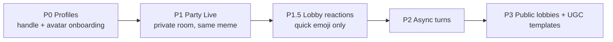
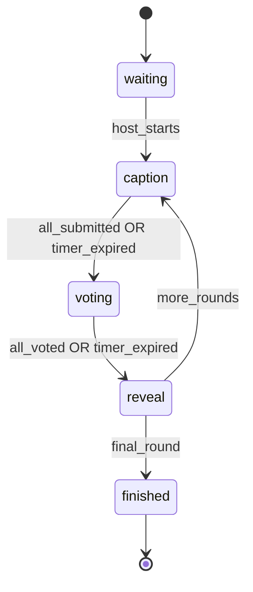

# MemeFight Party — Live Private Rooms (Make It Meme Style)

**Date:** 2026-06-03  
**Status:** P1 shipped — polish 2026-05-31  
**Phase:** New product surface (`/party`) — P0 Profiles + P1 Live MVP + **P1.5 Lobby Reactions**

## Goal

Let logged-in friends play a live meme-caption party game on MemeFight: private invite code → lobby → same-meme captions → vote → reveal → final scoreboard. **100% free.** No async, no public matchmaking, no GIF rounds in v1.

## UI / UX

**Out of scope for this spec.** Visual design and front-end components are supplied separately by the product owner (brutalist design folder). This spec defines **API contracts, room state, Realtime payloads, and RPC behavior** that any UI must consume.

---

## Success Criteria

- 2–8 logged-in players complete a 5-round private game in under 10 minutes without manual refresh
- Invite link `/party/join/{code}` survives Magic Link login (`returnTo` preserved)
- Reconnect within 60s restores correct phase and player score
- Phase transitions are server-authoritative; clients cannot skip phases or double-vote
- Captions pass basic profanity filter before persist
- Stuck rooms auto-advance or close via timeout fallback (no orphaned `caption` phase forever)

## Non-Goals (v1)

| Area | Deferred |
|------|----------|
| Async / turn-based sessions | Phase 2 |
| Public lobbies / matchmaking | Phase 3 |
| GIF templates / Giphy / Tenor | Phase 2+ |
| User-uploaded templates | Phase 3 |
| Party XP / Battle Pass integration | Phase 2 (isolated in v1) |
| Spectator mode | Later |
| Freitext in-room chat | Phase 2+ |
| Random-meme / custom-prompt modes | Later |
| Public profile pages (`/u/:handle`) | Later (P0 = handle + avatar only) |
| Push / email notifications | Later |
| i18n (UI copy) | DE first; captions any language |

---

## Phasing



**This spec covers P0 + P1 + P1.5.** P1.5 ships in the same release train as P1 (lobby UX polish, no new game phases).

---

## Section A — Game Rules (P1)

### Room type

- **Private live room** with 6-character invite code (e.g. `ABC123`)
- Routes: `/party`, `/party/create`, `/party/join/[code]`, `/party/room/[id]`
- All players **must be authenticated**; anonymous spectators excluded in v1

### Players

- **Minimum 2** to start, **maximum 8**
- Host creates room; host starts game when `count(players) >= 3`
- Host may leave before start; after start, host promotion runs inside `party_advance_phase` (see Section B)

### Mode: Same Meme

- Each round picks one template from `party_templates` (random without repeat within same room until pool exhausted)
- All players caption the **same** image
- One caption submission per player per round

### Rounds

- Host selects **3, 5, or 7** rounds at create time (default **5**)
- Scoring: **+1 point per vote** received on that round's submission (no bonus points in v1)
- Ties on final scoreboard: shared rank (both show 🏆)

### Timers (fixed in v1)

| Phase | Duration |
|-------|----------|
| Caption | 60s |
| Vote | 30s |
| Reveal | 8s (auto-advance) |
| Lobby | No timeout |

Host cannot adjust timers in v1.

### Voting rules

- Each player casts **exactly one vote** per round
- **Voting for own submission is allowed**
- Submissions shown in **random order** (seed = `room_id + round` for consistency across clients)
- Vote hidden until reveal phase

### Caption rules

- Max **120 characters**, trimmed
- Block empty / whitespace-only
- Server-side profanity list (same word list module as future moderation; v1 = reject with generic error)
- No emoji restriction

---

## Section A2 — Lobby Reactions (P1.5)

Lightweight “chat” in the **lobby only** (`phase = waiting`, `status = open`). No freitext — fixed quick reactions only. Disabled once the host starts the game.

### Reactions (fixed set)

| Key | Emoji | Label (DE UI) |
|-----|-------|---------------|
| `laugh` | 😂 | — |
| `eyes` | 👀 | — |
| `fire` | 🔥 | — |

Keys are stored in DB; UI maps to emoji. **No custom emoji, no text.**

### Rules

- **Lobby only:** RPC rejects if `party_rooms.phase != 'waiting'`
- **Rate limit:** max **1 reaction per 2 seconds** per user — enforced in `party_send_reaction` via `party_players.last_reaction_at` (see Section D). **Not Upstash** (lobby-only, low volume; PK `(room_id, user_id)` already indexes the check). RPC returns `rate_limited`.
- **Snapshot / reconnect feed:** max **20** reactions, **`created_at` within last 5 seconds** only — not full lobby history (see Section E).
- **DB retention:** rows may accumulate during lobby; bulk-deleted on game start (see **Game-start cleanup** below).
- **Moderation:** not required (closed enum); no report flow in P1.5
- **Privacy:** reactions visible to all room members; not shown on post-game scoreboard

### Game-start cleanup (no thundering herd)

`party_start_game` still runs `DELETE FROM party_reactions WHERE room_id = ?` for DB hygiene, but clients **must not** receive N delete events:

1. **Host client:** unsubscribe from `party_reactions` Realtime **before** calling `POST /api/party/start`.
2. **All clients:** on `party_rooms` Realtime update where `phase != 'waiting'`, immediately unsubscribe from `party_reactions` and clear local reaction UI — **before** processing other phase UI. The phase change on `party_rooms` is the single authoritative “lobby ended” signal.
3. **Do not** rely on DELETE events to clear the feed. No Broadcast needed in v1 if (1) and (2) are followed.

DELETE remains server-side only; connected clients that miss the phase event get an empty `recentReactions` on next snapshot (phase ≠ waiting).

### UX (UI folder)

- Reaction bar under player list in lobby
- Incoming reactions via Realtime INSERT (live) or snapshot slice (reconnect)
- Ephemeral toasts or small feed (`@handle 😂`); cap visible feed at ~20 items client-side
- Bar hidden during `caption` / `voting` / `reveal` / `finished`

### Realtime

- Subscribe to `party_reactions` **only** while local state is lobby (`phase === waiting`)
- Unsubscribe on game start (host: pre-start RPC; everyone: on `party_rooms.phase` change) — see above
- Safe: no gameplay leak (lobby phase only)

---

## Section B — Room State Machine



### Phase enum

`waiting | caption | voting | reveal | finished`

### Server fields on `party_rooms`

| Field | Purpose |
|-------|---------|
| `status` | `open` (lobby) or `in_progress` or `finished` |
| `phase` | Current phase enum |
| `current_round` | 1-based |
| `round_count` | 3, 5, or 7 |
| `template_id` | Active template FK |
| `phase_ends_at` | timestamptz; null in `waiting` / `finished` |
| `phase_seed` | int; shuffle seed for submission order |

### Transition authority

All transitions via Postgres RPC **`party_advance_phase(p_room_id uuid)`**:

1. **Host liveness check (always, first step):** if current host `last_seen_at < now() - interval '60 seconds'`, promote the remaining player with earliest `joined_at` (`party_players.is_host = true`, `party_rooms.host_id` updated). Atomic, no separate cron or client-side promotion logic.
2. Validates caller is room member **or** `pg_cron` (service role)
3. Validates phase preconditions (timer expired OR denormalized counters complete — see Section C)
4. Updates `party_rooms` atomically
5. On entering `caption`: select next template; reset `caption_count = 0`, `votes_cast_count = 0`
6. On entering `reveal`: aggregate votes from `party_votes` (server-side only), write `party_round_results`, update `party_players.score`
7. On entering `finished`: set `status = finished`

**Clients must not write `phase` directly.**

### Timer fallback

**Decision: Supabase `pg_cron` only** for scheduled phase advances. **No Vercel Cron** for in-game timers (Vercel minimum interval is 60s — too coarse for 30s vote phases and would duplicate work).

| Mechanism | Role |
|-----------|------|
| **`pg_cron` every 15s** | Calls `party_advance_stale_rooms()` → `party_advance_phase` for each room where `phase_ends_at < now()` and `status = in_progress` |
| **Client invoke** | Any room member may call `party_advance_phase` when local clock ≥ `phase_ends_at` (idempotent; handles races with cron) |
| **Vercel Cron** | **Not used** for phase advance in v1 |

Abandoned-room cleanup (`open` rooms idle 24h) runs in the same `pg_cron` job at lower frequency (e.g. hourly check inside the function), not via Vercel.

---

## Section C — Architecture

### Principles

1. **Server-authoritative** — mirror battle voting pattern (`cast_vote` RPC)
2. **Realtime = sync** — Supabase Realtime postgres_changes; UI renders from DB state
3. **UI decoupled** — JSON snapshot + Realtime deltas; brutalist UI folder maps props later

### Realtime subscriptions

Channel name: `party:{room_id}`

**Decision: `party_votes` is never on Realtime.** Even with SELECT blocked, Realtime INSERT events leak timing (“someone just voted”). Votes are **RPC-only writes, no client SELECT, not in `supabase_realtime` publication**.

| Table | Realtime | Notes |
|-------|----------|-------|
| `party_rooms` | Yes | Phase changes, `phase_ends_at`, `caption_count`, `votes_cast_count` |
| `party_players` | Yes | Join/leave, score (score updates visible from `reveal` onward) |
| `party_submissions` | **Phase-dependent** | See below |
| `party_votes` | **No** | Never published to Realtime |
| `party_round_results` | Yes | Only populated on entering `reveal`; safe to subscribe |

**Caption phase:** do **not** subscribe to `party_submissions` (INSERT events would leak submit timing/authorship). Progress via denormalized `party_rooms.caption_count` updated by `party_submit_caption` RPC. Clients poll own submission via snapshot/`mySubmission` only.

**Voting / reveal phases:** subscribe to `party_submissions` (RLS allows all captions in room). Vote progress via `party_rooms.votes_cast_count`, not vote rows.

**Reveal phase:** subscribe to `party_round_results` for per-submission vote counts. Counts are written once when entering `reveal` — no live vote stream.

### Vote & result access (canonical)

1. **`party_cast_vote`** — SECURITY DEFINER RPC; inserts into `party_votes`; increments `party_rooms.votes_cast_count`; returns `{ ok: true }` only (no vote totals).
2. **`party_votes`** — RLS enabled, **no SELECT policy** for `authenticated` (default deny). Only SECURITY DEFINER RPCs / service role read.
3. **`party_round_results`** — populated in `party_advance_phase` when transitioning `voting → reveal`; room players may SELECT during `reveal` / `finished`.
4. **Snapshot API** — `GET /api/party/rooms/[id]` uses server client to assemble counts from `party_round_results` (never exposes raw vote rows to clients).

### Caption rendering

**v1 recommendation:** Client-side text overlay on template during caption + voting phases (template URL + text boxes from `party_templates.text_boxes` jsonb).

Optional `rendered_path` on `party_submissions` for share/export later — **not required for MVP**.

`text_boxes` shape:

```json
[
  { "id": "top", "x": 0.05, "y": 0.05, "w": 0.9, "h": 0.2, "align": "center", "maxLines": 2 },
  { "id": "bottom", "x": 0.05, "y": 0.75, "w": 0.9, "h": 0.2, "align": "center", "maxLines": 2 }
]
```

Coordinates normalized 0–1 relative to image dimensions.

### Template assets

- Bucket: `party-templates` (public read)
- ~30 seed PNG/WebP files, self-made or licensed
- Metadata + `LICENSE.md` per pack in repo (`assets/party-templates/`)
- No copyrighted meme screenshots as core assets

---

## Section D — Data Model

### P0: `profiles`

```sql
create table public.profiles (
  user_id uuid primary key references auth.users (id) on delete cascade,
  handle text not null unique,
  avatar_url text,
  created_at timestamptz not null default now(),
  constraint profiles_handle_format check (handle ~ '^[a-z0-9_]{3,20}$')
);

alter table public.profiles enable row level security;

create policy "profiles_public_read"
  on public.profiles for select to authenticated, anon using (true);

create policy "profiles_own_update"
  on public.profiles for update to authenticated
  using (auth.uid() = user_id) with check (auth.uid() = user_id);

create policy "profiles_own_insert"
  on public.profiles for insert to authenticated
  with check (auth.uid() = user_id);
```

**Onboarding gate:** User without `profiles` row (or null handle) redirected to `/onboarding` before `/party/*`.

Avatar: upload to `avatars/{user_id}.webp` or preset emoji/color grid (UI decision).

### P1: Party tables

```sql
create table public.party_templates (
  id uuid primary key default gen_random_uuid(),
  image_path text not null,
  text_boxes jsonb not null default '[]',
  active boolean not null default true,
  sort_order int not null default 0
);

create table public.party_rooms (
  id uuid primary key default gen_random_uuid(),
  code text not null unique,
  host_id uuid not null references auth.users (id),
  status text not null default 'open'
    check (status in ('open', 'in_progress', 'finished', 'abandoned')),
  round_count smallint not null default 5 check (round_count in (3, 5, 7)),
  current_round smallint not null default 0,
  phase text not null default 'waiting'
    check (phase in ('waiting', 'caption', 'voting', 'reveal', 'finished')),
  template_id uuid references public.party_templates (id),
  phase_ends_at timestamptz,
  phase_seed int,
  caption_count smallint not null default 0,
  votes_cast_count smallint not null default 0,
  used_template_ids uuid[] not null default '{}',
  created_at timestamptz not null default now()
);

create table public.party_players (
  room_id uuid not null references public.party_rooms (id) on delete cascade,
  user_id uuid not null references auth.users (id) on delete cascade,
  score int not null default 0,
  is_host boolean not null default false,
  joined_at timestamptz not null default now(),
  last_seen_at timestamptz not null default now(),
  last_reaction_at timestamptz,
  primary key (room_id, user_id)
);

create table public.party_submissions (
  id uuid primary key default gen_random_uuid(),
  room_id uuid not null references public.party_rooms (id) on delete cascade,
  round smallint not null,
  user_id uuid not null references auth.users (id),
  caption text not null check (char_length(caption) between 1 and 120),
  created_at timestamptz not null default now(),
  unique (room_id, round, user_id)
);

create table public.party_votes (
  room_id uuid not null references public.party_rooms (id) on delete cascade,
  round smallint not null,
  voter_id uuid not null references auth.users (id),
  submission_id uuid not null references public.party_submissions (id),
  created_at timestamptz not null default now(),
  primary key (room_id, round, voter_id)
);

-- Written only on voting → reveal; clients read this, never party_votes
create table public.party_round_results (
  room_id uuid not null references public.party_rooms (id) on delete cascade,
  round smallint not null,
  submission_id uuid not null references public.party_submissions (id) on delete cascade,
  vote_count int not null default 0,
  primary key (room_id, round, submission_id)
);

create table public.party_reactions (
  id uuid primary key default gen_random_uuid(),
  room_id uuid not null references public.party_rooms (id) on delete cascade,
  user_id uuid not null references auth.users (id) on delete cascade,
  reaction_key text not null check (reaction_key in ('laugh', 'eyes', 'fire')),
  created_at timestamptz not null default now()
);

create index party_reactions_room_created_idx
  on public.party_reactions (room_id, created_at desc);
```

### RLS policies (migration-required detail)

**Helper:** membership subquery reused in policies:

```sql
-- Returns true if auth.uid() is a player in the given room
create or replace function public.party_is_member(p_room_id uuid)
returns boolean
language sql
stable
security definer
set search_path = public
as $$
  select exists (
    select 1 from public.party_players
    where room_id = p_room_id and user_id = auth.uid()
  );
$$;
```

**`party_submissions`** — caption secrecy enforced in DB, not just snapshot logic:

```sql
alter table public.party_submissions enable row level security;

-- INSERT: denied for clients (RPC only)
-- (no insert policy for authenticated)

-- SELECT: own row always; co-players' rows only when room phase >= voting
create policy "party_submissions_select"
  on public.party_submissions for select to authenticated
  using (
    public.party_is_member(room_id)
    and (
      user_id = auth.uid()
      or exists (
        select 1 from public.party_rooms pr
        where pr.id = party_submissions.room_id
          and pr.phase in ('voting', 'reveal', 'finished')
      )
    )
  );
```

During **`caption`** phase, RLS returns **only the caller's own submission** — direct Supabase client queries cannot read others' captions (prevents copy cheats). Snapshot API must respect the same rules (use user-scoped client, not service role, for submission lists).

**`party_votes`** — no client access:

```sql
alter table public.party_votes enable row level security;
-- No SELECT, INSERT, UPDATE, or DELETE policies for authenticated.
-- All access via SECURITY DEFINER RPCs (party_cast_vote, party_advance_phase).
```

**`party_round_results`** — readable only after reveal:

```sql
alter table public.party_round_results enable row level security;

create policy "party_round_results_select"
  on public.party_round_results for select to authenticated
  using (
    public.party_is_member(room_id)
    and exists (
      select 1 from public.party_rooms pr
      where pr.id = party_round_results.room_id
        and pr.phase in ('reveal', 'finished')
    )
  );
```

**`party_reactions`** — lobby-only, enum-constrained:

```sql
alter table public.party_reactions enable row level security;

create policy "party_reactions_select"
  on public.party_reactions for select to authenticated
  using (
    public.party_is_member(room_id)
    and exists (
      select 1 from public.party_rooms pr
      where pr.id = party_reactions.room_id
        and pr.phase = 'waiting'
    )
  );

-- INSERT via RPC only (no direct insert policy for authenticated)
```

**Realtime publication** (explicit migration step):

```sql
alter publication supabase_realtime add table public.party_rooms;
alter publication supabase_realtime add table public.party_players;
alter publication supabase_realtime add table public.party_round_results;
alter publication supabase_realtime add table public.party_reactions;
-- party_submissions: add to publication (RLS still applies; clients unsubscribe during caption)
-- party_votes: NEVER add to publication
```

### RLS summary

| Table | Select | Insert | Update |
|-------|--------|--------|--------|
| `party_rooms` | Members | RPC create | RPC only |
| `party_players` | Co-members | RPC join | RPC (score, last_seen, is_host) |
| `party_submissions` | **Own always; others only if phase ≥ voting** | RPC only | — |
| `party_votes` | **Denied** (RPC internal only) | RPC only | — |
| `party_round_results` | Members, phase ≥ reveal | RPC only | — |
| `party_reactions` | Members, **phase = waiting only** | RPC only | — |

All gameplay writes via **SECURITY DEFINER RPCs**; RLS is defense in depth.

### Core RPCs

| RPC | Caller | Action |
|-----|--------|--------|
| `party_create_room(round_count)` | Auth user | Creates room + code, inserts host as player |
| `party_join_room(code)` | Auth user | Adds player if room `open` and not full |
| `party_start_game(room_id)` | Host | Requires ≥3 players; sets `in_progress`, round 1, `caption`; bulk-deletes `party_reactions` (clients unsubscribed — see A2) |
| `party_send_reaction(room_id, reaction_key)` | Player | **Lobby only**; enum `laugh` \| `eyes` \| `fire`; rate limit via `party_players.last_reaction_at` (≥2s) |
| `party_submit_caption(room_id, caption)` | Player | Caption phase only; profanity check; increments `caption_count` |
| `party_cast_vote(room_id, submission_id)` | Player | Voting phase only; increments `votes_cast_count`; returns `{ ok: true }` only |
| `party_heartbeat(room_id)` | Player | Updates `last_seen_at` |
| `party_advance_phase(room_id)` | Member or `pg_cron` | Host migration + idempotent phase transition |
| `party_advance_stale_rooms()` | `pg_cron` only | Batch advance for expired `phase_ends_at` |
| `party_leave_room(room_id)` | Player | Remove player; host migration rules |

---

## Section E — HTTP API (Next.js)

Thin wrappers calling Supabase RPC + returning snapshot JSON for UI folder.

| Method | Route | Body | Response |
|--------|-------|------|----------|
| POST | `/api/party/rooms` | `{ roundCount?: 3\|5\|7 }` | `{ room, code, joinUrl }` |
| POST | `/api/party/join` | `{ code }` | `{ room, players, profile }` |
| POST | `/api/party/start` | `{ roomId }` | `{ room }` |
| POST | `/api/party/submit` | `{ roomId, caption }` | `{ submission }` |
| POST | `/api/party/vote` | `{ roomId, submissionId }` | `{ ok: true }` |
| POST | `/api/party/heartbeat` | `{ roomId }` | `{ ok: true }` |
| POST | `/api/party/reaction` | `{ roomId, reactionKey }` | `{ reaction }` |
| GET | `/api/party/rooms/[id]` | — | Full snapshot (reconnect) |

All routes return **401** if unauthenticated, **403** if not in room, **409** if wrong phase.

### Snapshot shape (for UI props)

```typescript
type PartySnapshot = {
  room: {
    id: string;
    code: string;
    status: "open" | "in_progress" | "finished" | "abandoned";
    phase: "waiting" | "caption" | "voting" | "reveal" | "finished";
    currentRound: number;
    roundCount: number;
    phaseEndsAt: string | null;
    template: { id: string; imageUrl: string; textBoxes: TextBox[] } | null;
  };
  players: Array<{
    userId: string;
    handle: string;
    avatarUrl: string | null;
    score: number;
    isHost: boolean;
    isYou: boolean;
  }>;
  submissions: Array<{
    id: string;
    userId: string;
    caption: string;
    voteCount?: number; // from party_round_results; reveal/finished only
  }>;
  captionCount: number; // party_rooms.caption_count; caption phase progress
  votesCastCount: number; // party_rooms.votes_cast_count; voting phase progress
  mySubmission: { id: string; caption: string } | null;
  myVote: { submissionId: string } | null; // only after voted; never others' votes
  recentReactions: Array<{
    id: string;
    userId: string;
    handle: string;
    reactionKey: "laugh" | "eyes" | "fire";
    createdAt: string;
  }>; // lobby only: max 20, last 5s; [] when phase !== waiting
};
```

**`recentReactions` query (snapshot + reconnect):**

```sql
select ... from public.party_reactions
where room_id = $1
  and created_at > now() - interval '5 seconds'
order by created_at desc
limit 20;
```

Live lobby UX appends via Realtime INSERT; snapshot slice is for reconnect / initial hydrate only — not a full scrollback.

### Visibility by phase (enforced in RLS + snapshot)

| Phase | `submissions` in snapshot | Realtime tables |
|-------|---------------------------|-----------------|
| `waiting` | `[]` | `party_rooms`, `party_players`, **`party_reactions`** |
| `caption` | `mySubmission` only (others hidden) | `party_rooms` (`caption_count`), `party_players` — **not** `party_submissions` |
| `voting` | All captions, shuffled, **no vote counts** | + `party_submissions`, `party_rooms` (`votes_cast_count`) |
| `reveal` | All captions + `voteCount` from `party_round_results` | + `party_round_results` |
| `finished` | Final scoreboard + last round results | same as reveal |

---

## Section F — Edge Cases

| Scenario | Behavior |
|----------|----------|
| Host disconnects before start | Room stays `open`; next `party_advance_phase` or `party_start_game` call runs host migration if host stale >60s |
| Host disconnects mid-game | **`party_advance_phase` step 1** promotes earliest `joined_at` player when host `last_seen_at` > 60s ago (max ~15s delay until next cron/client advance, not 120s) |
| Player disconnects mid-round | Caption/vote timers continue; missing caption = empty submission not allowed — player gets 0 votes that round |
| Timer expires, not all submitted | Advance to voting; players without submission excluded from voting pool that round |
| Timer expires, not all voted | Advance to reveal; partial votes count |
| Player tries rejoin finished room | Read-only scoreboard snapshot |
| Invalid / full code | 404 / 409 with clear error codes |
| Profanity in caption | RPC reject `profanity_rejected` |
| Duplicate join | Idempotent return existing membership |
| Room code collision | Retry generate (6-char base32, exclude ambiguous chars) |
| All templates used | Reset `used_template_ids` pool |
| <3 players at start attempt | RPC reject `not_enough_players` |
| 9th join attempt | RPC reject `room_full` |
| Reaction during game | RPC reject `wrong_phase` |
| Reaction spam | RPC reject `rate_limited` (`last_reaction_at` + 2s on `party_players`) |
| Game start with active reaction feed | Host unsubscribes pre-start; all clients unsubscribe on `party_rooms.phase` change — ignore DELETE events |

### Abandoned / stuck rooms

- `party_advance_stale_rooms()` (pg_cron): advance in-progress rooms past `phase_ends_at`
- Same function (hourly branch): `open` rooms with no player heartbeat for **24h** → `status = abandoned`
- `in_progress` rooms stuck with `phase_ends_at` null for > **2× phase timer** → force advance (safety net)

---

## Section G — Moderation & Trust

- Reuse existing admin auth pattern (`/admin/*`)
- New table optional v1: `party_reports (room_id, submission_id, reason, created_at)` — mirror `battle_reports`
- Captions stored in DB; admin can query by `room_id` for disputes
- No public listing of party rooms (no SEO index on `/party/room/*`)
- Rate limits (middleware or RPC): max **5 rooms created per user per hour**, max **10 joins per minute**

---

## Section H — Auth Flow

1. User opens `/party/join/ABC123`
2. If not logged in → redirect `/auth/login?returnTo=/party/join/ABC123`
3. After Magic Link callback → land on join page → auto-call `party_join_room`
4. If no profile → redirect `/onboarding?returnTo=...` then join

Existing auth callback already supports `returnTo` / `next` sanitization — extend allowlist for `/party/*`.

---

## Section I — Integration with MemeFight

| Surface | v1 behavior |
|---------|-------------|
| Header nav | Link to `/party` (UI folder decides placement) |
| Battle Pass / XP | **No grants** from party in v1 |
| Battles feed | Unchanged |
| Branding | "MemeFight Party" sub-label acceptable |

---

## Section J — Testing

### Manual QA

- 4 browser profiles: create → join → **lobby reactions** → 5 rounds → scoreboard
- Login interrupt: guest opens join link → login → lands in lobby
- Reconnect: kill tab during voting → reopen within 60s
- Timer edge: only 1 player submits before caption ends
- Host leave mid-game → co-host promotion

### Automated (implementation plan)

- RPC unit tests: phase transitions, idempotent advance, vote uniqueness, host promotion inside advance, caption RLS (cannot SELECT peer captions in caption phase)
- API route tests: auth gates, error codes
- Optional Playwright: one happy-path 3-player flow (headless, mocked Realtime)

### Ops

- Feature flag env `PARTY_ENABLED=true` for beta rollout
- Log stuck phases to existing observability (console / Vercel logs v1)

---

## Section K — File Layout (implementation hint)

```
app/(site)/party/...
app/(site)/party/design/page.tsx   ← design preview navigator (noindex)
app/(site)/onboarding/...
app/api/party/...
components/brutal/party/           ← ported design system (see Section L)
lib/party/types.ts                 ← PartySnapshot + reaction keys
lib/party/state.ts                 ← phase helpers, snapshot builder (TBD)
lib/party/profanity.ts             ← word list (TBD)
supabase/migrations/...            ← profiles + party tables + RPCs
assets/party-templates/            ← seed images + LICENSE
```

---

## Section L — UI Integration Map

**Source:** `components/brutal/party/` (ported from external design export).  
**Preview:** `/party/design` — full-screen navigator, `robots: noindex`.  
**Exports:** `@/components/brutal/party` (P1 components + types).

### P1 screens → routes & data

| Component | File | Route / when | `PartySnapshot` / API |
|-----------|------|--------------|------------------------|
| `PartyJoinScreen` | `screens/JoinScreen.tsx` | `/party`, `/party/join/[code]` | `onJoin` → `POST /api/party/join`; `onCreate` → `POST /api/party/rooms`. Prop `designPreview={false}` in prod. |
| `AvatarPicker` | `screens/AvatarPicker.tsx` | `/onboarding` | Writes `profiles` (handle, avatar). Encodes preset as `party:{AvatarId}:{color}` in `profiles.avatar_url` via `lib/party/avatar.ts`. |
| `PartyLobbyScreen` | `screens/HostOnboarding.tsx` | `/party/room/[id]` when `phase=waiting` | `code`, `players`, `recentReactions`, `canStart`; `onSendReaction` → `POST /api/party/reaction`; `onStartGame` → unsubscribe reactions then `POST /api/party/start`. |
| `LobbyReactions` | `lobby-reactions.tsx` | Inside lobby only | `recentReactions` (max 20 / 5s); Realtime on `party_reactions` until phase change. |
| `MobileGame` | `mobile/*` + `screens/MobileGame.tsx` | Room when `caption` / `voting` / `reveal` | **Prod:** `PartyMobileCaption`, `PartyMobileVoting`, `PartyMobileReveal` wired to `PartySnapshot`. **Design preview:** same components in `PhoneFrame` with `embedded` on `/party/design`. |
| `ShareCard` | `screens/ShareCard.tsx` | `phase=finished` | Winner handle, round meme, scores from snapshot. Copy link, Twitter intent, PNG download. |
| `ErrorStates` | `party-error-state.tsx` + `screens/ErrorStates.tsx` | Join/room errors | **Prod:** `PartyErrorState` + `lib/party/copy-de.ts` for `room_full`, `bad_code`, `disconnected`, debounced `everyone_left`. **Design preview only:** `banned`, `no_submissions` in ErrorStates grid. |
| `Tutorial` | `party-tutorial-overlay.tsx` + `screens/Tutorial.tsx` | First visit on `/party` | **Prod:** overlay, `localStorage` key `memefight_party_tutorial_v1`; blocked when `?error=` present. **Design preview:** static `Tutorial` screen on `/party/design`. |

### Deferred (in repo, not P1)

| Component | Reason |
|-----------|--------|
| `TemplateLibrary` | Server picks template; no host library in v1 |
| `SpectatorMode` | Spec non-goal |
| `PremiumBundle` | Free-only product |

### Integration notes

- **Templates:** `PartyTemplateFrame` loads Storage WebP URLs from `party_templates` (`placeholder-*.webp`). Generate/upload via `scripts/generate-party-templates.mjs` then `scripts/upload-party-templates.mjs`.
- **DE copy:** Production strings in `lib/party/copy-de.ts`. `/party/design` preview screens remain EN by design.
- **Caption UX:** Single `caption` field (120 chars); pipe `\|` for two lines in UI.
- **Nav:** Header link **PARTY** in `components/site-header.tsx`. Footer **Party** + **Credits** in `components/site-footer.tsx`.
- **Design preview:** `JoinScreen` alias passes `designPreview` (public lobbies visible); production uses `PartyJoinScreen` without it.

---

## Open Items

### Done (P1 polish, 2026-05-31)

- MobileGame layouts wired to live `PartySnapshot` (caption / voting / reveal)
- DE copy pass on production party screens
- Avatar preset mapping (`party:{id}:{color}` in `profiles.avatar_url`)
- ErrorStates wired to API and client signals (incl. debounced `everyone_left`)
- Tutorial overlay on first `/party` visit
- WebP placeholder template pipeline

### Done (P1.9 quick wins, 2026-06-04)

- ShareCard **PNG** export (`html-to-image`, 1200×675)
- Footer **Party** link + `/credits` attribution page
- Licensed meme template images (import pipeline + Supabase Storage)
- Server-side analytics funnel (`party_analytics_events`, SQL views, `npm run party:analytics`)

### Still open / deferred

- Phase 3: public lobbies, user-uploaded templates, spectator mode, premium bundle

---

## Approval Log

| Section | Status |
|---------|--------|
| Scope & P1 rules (A = private live) | Approved |
| Architecture & data model | Approved |
| Edge cases, moderation, testing | Approved |
| Vote secrecy, cron, caption RLS, host promotion | Revised per review 2026-06-03 |
| P1.5 lobby quick reactions | Added 2026-06-03 |
| P1.5 thundering herd, rate-limit column, snapshot window | Revised per review 2026-06-03 |
| UI port + Section L integration map | Done 2026-06-03 |
| P1 polish doc sync | Done 2026-05-31 |

**Next step:** P1 + P1.9 shipped; Phase 3 features per Open Items above.
